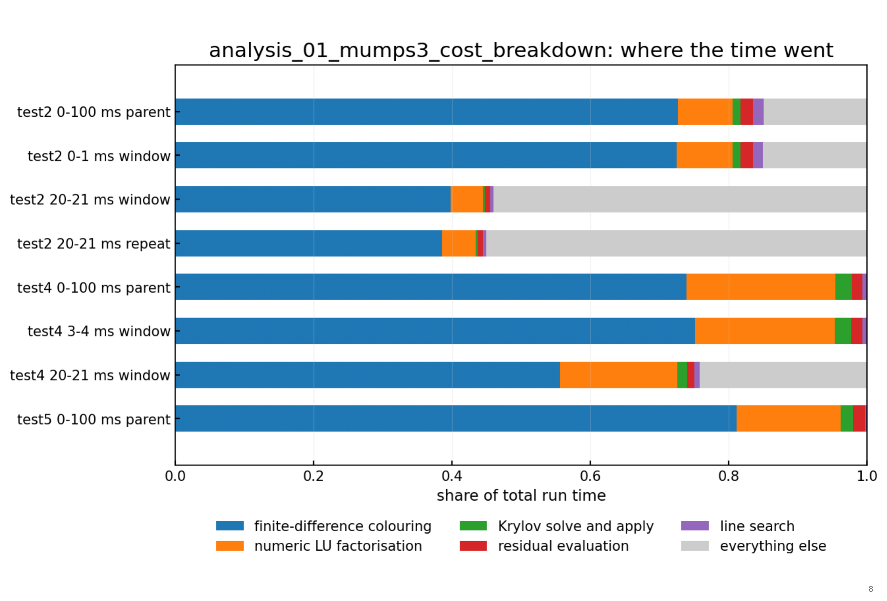

# Hermes-3 solver optimisation — design summary

2026-09-20

## The problem

Hermes-3 simulates the plasma edge of a tokamak — the few centimetres between the hot confined core and the material wall, where the plasma must cool from a hundred million degrees to something a metal surface can survive. These simulations are how we predict whether a reactor's exhaust will melt its divertor.

They are also very slow. The equations are stiff: they couple processes whose natural timescales differ by many orders of magnitude, so an explicit method is forced into absurdly small steps. The practical answer is an implicit solver — here PETSc's SNES, solving a nonlinear system at every timestep — and the cost of a simulation then sits almost entirely inside that solver.

How slow, concretely, from this project's own measurements:

- A 100 ms simulation of one test case took 16.6 hours on ten cores. That case advances about 145 ms of plasma time per day of wall clock.
- Reaching a steady state, which is what most physics studies actually need, can take days to weeks per case.
- A study typically needs tens of cases, so the solver's speed sets which questions are askable at all.

The solver exposes on the order of fifty settings — tolerances, how often the Jacobian is rebuilt, which linear solver and preconditioner, how the timestep adapts. They interact strongly, and in practice they are chosen by hand, by a small number of people, from intuition built up over years. Nobody has searched the space systematically. Our own records show four distinct configurations across 48 runs, and the spread between them is large: on one test case the recorded throughput spans roughly a factor of three.

That gap is the opportunity. If a competent search over solver settings finds even a two-fold speed-up, it converts a week of waiting into three days — on every study that follows, for every user of the code.

The difficulty is that each evaluation is expensive, the objective is noisy, and a configuration can be fast for the wrong reason: taking sloppy steps and converging to the wrong plasma. A naive optimisation loop would happily find those. Most of the design below exists to make an evaluation cheap enough to repeat, and trustworthy enough to act on.

## What we optimise over

The search space is the solver's settings, in six groups:

- Nonlinear solve — which Newton variant, the three convergence tolerances, the iteration and function-evaluation caps, the line search.
- Jacobian — matrix-free or assembled, how many iterations a Jacobian is reused for, whether it persists across steps, whether colouring is used, whether small entries are pruned.
- Variable scaling — whether state variables and time derivatives are rescaled to order unity, and how often.
- Linear solve — Krylov method, iteration cap, restart length, initial guess.
- Preconditioner — type, and if it is a direct factorisation, which package (MUMPS, STRUMPACK, SuperLU) and that package's own options: ordering, workspace, null-pivot handling, block low-rank compression.
- Timestep control — the adaptation strategy and its gains, growth and reduction factors, caps and floors.

About fifty knobs in total. They are of mixed type — switches, unordered choices, integers, continuous values over several decades — and, importantly, they are conditional. The factorisation package means nothing unless the preconditioner is a direct solve. The PID gains mean nothing unless the timestep controller is the PID one. A sampler that ignores this structure spends most of its budget on settings that are not in force.

We are writing this down as a declarative dictionary, one entry per knob: type, range or allowed values, which solver it applies to, what it is conditional on, and a note on what it trades against what. That file is the contract between whatever proposes configurations and the machinery that runs them.

Two things make the space more tractable than fifty dimensions suggests, and one makes it worse.

In our favour: the defaults are not considered choices. We captured what PETSc actually built for our current best configuration, and found settings nobody had ever thought about. The clearest example — the restart length of the Krylov method is 30 while the iteration cap is 260, so a single solve can restart nearly nine times, discarding its accumulated convergence history each time. That value is simply PETSc's default. Nobody chose it. A space description built from what the code actually does, rather than from what the input file mentions, surfaces these immediately.

Also in our favour: much of the space is known to be bad, and experienced users can say so. The dictionary records that knowledge rather than making a search rediscover it.

Against us: the knobs interact, and the interactions are the interesting part. Lagging the Jacobian reduces the number of expensive Jacobian builds but increases nonlinear iterations; matrix-free trades a cheap Jacobian for many more linear iterations. Ranking on any single count rather than on time flatters whichever choice moves work into a cheaper-looking counter. This is why the objective is wall clock, with all the counts recorded alongside.

## Making an evaluation cheap: windows and rungs

If every evaluation cost sixteen hours, no search of any kind would be possible. The central trick is that we do not evaluate a configuration on a whole simulation. We evaluate it on a slice.

We first make one parent run per test case: a full simulation from initial conditions to 100 ms, at a fixed code build with a fixed starting configuration. It writes its state every millisecond. From those saved states we cut seeds — restart files at chosen times — and a window is a short simulation restarted from a seed and run to a later time. A window named `test4_1.0-2.0ms` restarts from the parent's state at 1.0 ms and runs to 2.0 ms.

This gives a fidelity ladder. Rung 0 is three windows of 0.2 to 0.5 ms; rung 1 is the same three, four times longer; rung 2 is the full 100 ms run. A configuration is screened cheaply, and only survivors pay for the expensive rung. The three window positions are chosen to probe different regimes — the violent transient from a flat start, the approach to steady state, and near-steady state — because a configuration that is good in one is not automatically good in another.

Two details matter more than they look.

Every window writes exactly 50 output steps, whatever its duration. Dump size scales with the number of outputs rather than the simulated time, so this fixes the storage cost per evaluation at roughly 100 MB regardless of which rung it is on.

A window does not inherit the parent's timestep or Jacobian history. It starts cold, so its first steps cost more than the parent paid at that point in the run. We deliberately do not correct for this. Every configuration pays the same penalty, and recovering quickly from a restart is a genuine solver virtue, not an artefact.

The honest weakness of this scheme is that a configuration can be slow early and fast late, so no single window predicts the full run, and a window's ranking need not match the full run's. We therefore do not trust windows by rank correlation. Each window measures a speed — plasma time per wall-clock second — at its position in the run, and the full-run cost is estimated by summing the time each stretch would take at its local speed. A real full run checks that estimate periodically. Promotion between rungs is deliberately generous, because the failure we most fear is a slow divergence that short windows cannot see.

We have not found this published. Using restart windows of one simulation as the fidelity levels of a tuning ladder appears to be novel, and it is one of the things we would most like a second opinion on.

## Trusting a result: correctness and the record

Speed alone is a trap. A configuration can be fast because it takes sloppy steps and converges to the wrong plasma, and timing will never reveal that. Correctness is therefore a pass/fail flag beside the cost, never a term inside the objective — we do not let a search trade accuracy for speed on its own initiative.

The check has two levels, because the simulations approach a steady state and two runs may take different paths there and both be right:

- A window check on every rung: a sanity band on four physical quantities — density and temperature at the separatrix, and their maxima at the divertor target. Failing it disqualifies the run. Passing it proves very little.
- An endpoint check on full runs only: does it reach the same steady state as the reference? This is the verdict that counts.

Outcomes are a fixed taxonomy, every state decidable by script from the log and the dump: completed, invalid (completed but failed the correctness check), diverged, timeout, crashed, cancelled. Two rules matter for the optimiser. A crash — MPI, memory, the machine — says nothing about the configuration and must never score as slow. A timeout is not a missing result; it is evidence that the configuration is at least that slow, and it is recorded as such. Failed runs stay in the record with their timings blank, because an unrecorded failure is a lie about the search space.

The record itself is deliberately boring, and deliberately split in two. One tab-separated file holds one row per run, about fifty columns, append-only, in git. That file is the whole-project record and it is the only thing committed. Beside it, outside git, sits one bundle directory per run holding the extracted evidence: timestep history, per-step solver statistics, residual history, the PETSc profile, the exact input file used.

The split is on purpose. Per-run evidence runs to megabytes and grows without limit, so committing it produces a repository nobody can clone; the index projects to about a megabyte at a thousand runs. The cost is real and worth stating: the evidence lives on one machine, so what survives a lost workstation is the index, not the tables the reports are drawn from.

Three rules keep it honest.

The index defines what exists. A run counts as part of this project if and only if it has a row. We never enumerate directories to discover runs, because directories get moved, copied and deleted by hand.

Nothing is typed twice. A row carries its declared intent before the run; the extractor fills every measured field afterwards. Each row states both what the run was meant to be testing and every way it actually differs from its named configuration — and a difference that was not declared gets flagged, because it means something changed that nobody intended.

Nobody reads fifty columns. Neither a person nor a model aggregates that table by eye. Measured work on model behaviour shows single-value lookup is near-perfect while counting and filtering across a table is exactly where reading fails, so queries go through a script that returns about ten columns, filtered and ranked.

## Where an optimiser plugs in

The system is two layers meeting at one narrow interface.

The runner is a plain command-line program with no judgement in it. It prepares a case from a seed, applies a configuration, launches it, watches it, extracts the record, and repeats. Because it decides nothing, it runs unattended and ports to any machine.

The optimiser decides what to try next. It reads a compact view of past results and writes a list of trials. It may be a language model, a conventional sampler, or a person writing a list by hand — the runner cannot tell the difference. The interface is two operations: suggest trials, report results. Swapping the optimiser changes nothing else in the system.

That separation is a deliberate hedge, and it comes from reading the evidence rather than from taste. We reviewed the literature on language models as optimisers in September 2026, and it is genuinely mixed:

- The value appears to be in proposing candidates when data are sparse, not in predicting outcomes. As a predictor, a language model loses to standard surrogate methods.
- A budget-matched study in June 2026 found the apparent advantage was mostly down to picking a sensible starting configuration. Seeded random search tied it at five evaluations and beat it by twelve.
- A March 2026 benchmark of agents tuning physics-solver parameters across eleven simulators reached 66 to 81 per cent success with iteration, but used 1.5 to 2.7 times more compute than plain scanning.
- Language-model optimisers tend to stagnate rather than converge, so a fallback path is not optional.

Our reading is that a model is most likely to earn its place as a cold-start proposer and as a reader of failures — looking at why a configuration diverged and suggesting what to change — rather than as the search algorithm itself. Sparse data and strong prior knowledge about solvers are exactly the conditions where it should do well, and expensive evaluations are exactly the conditions where being wrong is costly.

So the design commits to four things regardless of which optimiser is used. Run the hand-tuned configuration and a seeded random search as controls, so any claimed advantage is measured against something. Show the model at most about thirty past trials, in a fixed table. Require a strict output schema that the runner validates before it launches anything. And fall back to the sampler if two consecutive batches drift off the space or repeat themselves.

This is the part of the design we would most value an outside view on: whether that division of labour is the right one, and what the realistic failure modes are.

## Status, and the open questions

What exists and works today:

- The measurement layer. A run's log and dump are extracted automatically into a row and a bundle — timings, iteration counts, Jacobian builds, PETSc profile shares, residual history, per-step solver statistics, failed solves with the reason PETSc gave for each. Verified against a live run.
- The record. Nine runs of the current configuration on a fixed build, plus a documented schema and a tool that re-derives stored numbers from raw artefacts to catch silent drift. An earlier campaign's 28 runs are kept frozen beside the index rather than mixed into it, because they were measured on a different build and answer questions this project has stopped asking.
- Parent runs for three test cases, and the seed library cut from two of them.
- The window generator, which cuts a seed and builds a window case from a name like `test4_1.0-2.0ms`.

Here is what that machinery produces, on the eight runs of the current configuration. It is a baseline portrait rather than an experiment, since nothing was varied across these runs, but it already answers the first question an optimiser would ask.

Building the Jacobian by finite-difference colouring takes 73 to 81 per cent of the time on the three full-length runs. The direct LU factorisation adds 5 to 22 per cent. The Krylov solve is under 3 per cent everywhere, because an exact LU factorisation converges the linear system in a single iteration.

That concentration is the practical case for this project. The cost is not spread thinly across the solver; it sits in one operation, and the knobs that govern how often that operation runs are exactly the ones nobody has searched.

What is designed but not built: the runner loop itself, the campaign configuration file, and any optimiser at all.

Four open questions, in the order we would most like to discuss them.

Is the window ladder sound? Using restart slices of one simulation as fidelity levels appears to be unpublished, and the obvious objection — that a short window does not predict a long run — is one we have tried to answer with a speed-summation estimate rather than rank correlation. We would like that argument attacked.

How should a mixed, conditional space be mapped? Fifty knobs of four different types, with dependencies that switch whole groups on and off. We do not currently have a principled answer beyond the dictionary itself.

What is the right objective for steady-state work? The ladder is built on plasma-time windows, but for a steady-state problem the honest question is how much work it takes to reach a residual level, not to reach a fixed simulated time. That matters especially for pseudo-transient methods, which are judged in residual space. Reconciling the two is unresolved.

Are our cheap rungs too cheap? The shortest windows we have timed cost 9 and 20 seconds. That is almost certainly below the level at which configurations can be told apart from noise, and the ladder will need retuning once rung 0 has been properly timed.

One smaller thing worth naming, because it shapes how much we trust our own numbers. The solver rescales every state variable to order unity before solving, which it must, since the variables span more than eight orders of magnitude. That rescaling floors each element at the solver's relative tolerance, so any element whose normalised magnitude falls below that tolerance is scaled by the floor rather than by its own size, and its residual is divided by the floor too. We measured how often this happens: in fourteen of the sixteen runs carrying the relevant diagnostic, the smallest scaling factor is exactly the relative tolerance, which is the signature of the floor being reached. Densities and temperatures stay clear of it because the physics floors them positive; momenta are the exposure, since they are signed and pass through zero at every stagnation point. What we have not yet measured is how much of the residual norm those floored elements actually carry. Until we do, residual-based objectives are not safe to tune against, and it is a reminder that some of what a search would find is the code's behaviour rather than the solver's.
